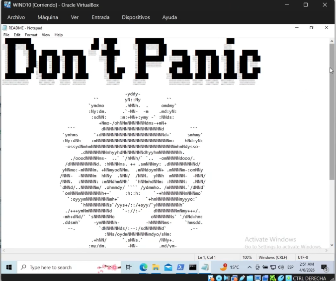
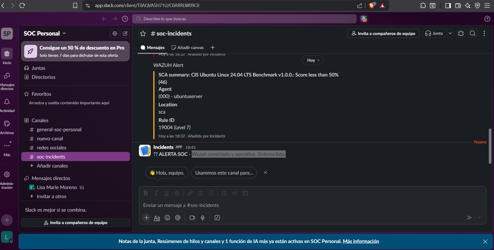
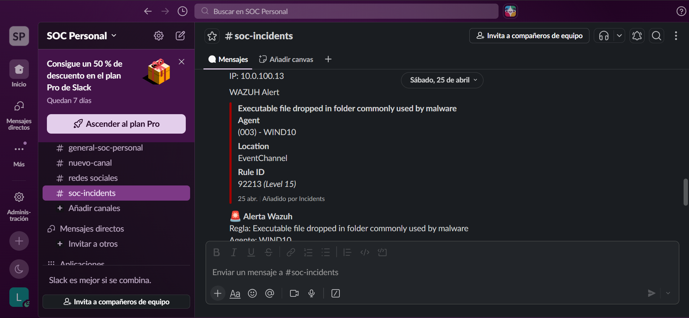
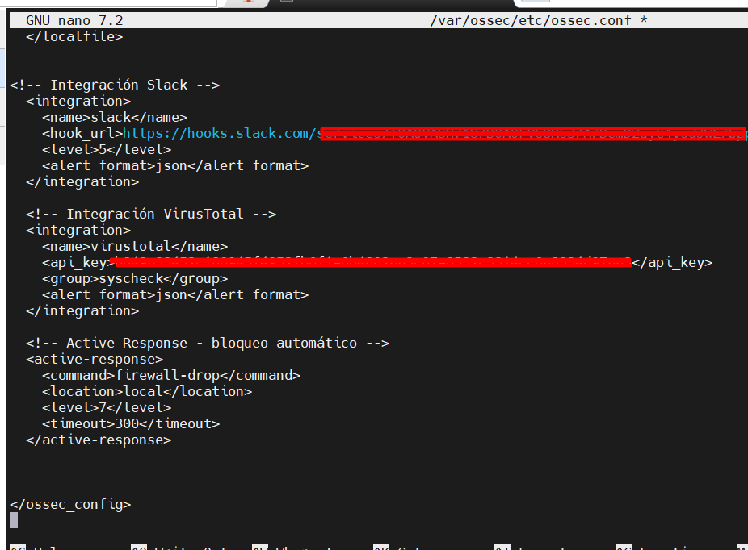

# 🦠 Ransomware Detection Home Lab — Wazuh + Infection Monkey

**Home Lab Personal · Abril 2026**  
**Analista:** Lisa M. Moreno | **Rol:** Blue Team / SOC Analyst  
**Entorno:** Ubuntu Server (Wazuh) + Windows 10 + Infection Monkey v2.3.0

---

## 📌 Resumen

Simulación controlada de un ataque de ransomware usando **Infection Monkey** sobre un endpoint Windows 10 monitorizado por **Wazuh SIEM**. El objetivo: demostrar detección en tiempo real, correlación con MITRE ATT&CK, y alertas automáticas a Slack.

El lab tiene tres capas defensivas encadenadas:
- 🔵 **Detección** → Wazuh con alertas nivel 15 (crítico)
- 🟡 **Enriquecimiento** → VirusTotal API analiza hashes automáticamente
- 🔴 **Respuesta** → `firewall-drop` activo en alertas nivel 7+

> ⚠️ Entorno 100% aislado en VirtualBox. Ningún sistema real fue afectado.

---

## 🏗️ Arquitectura

**Red interna (NAT) — VirtualBox**

- 🖥️ **Ubuntu Server** `100.84.115.29` — Wazuh Manager (SIEM)
- 💻 **Windows 10 WIND10** — Wazuh Agent + Sysmon (víctima)
- 🐒 **Infection Monkey** `100.111.171.76` — Simulador de ransomware

**Flujo de detección:**

1. Infection Monkey cifra archivos en WIND10
2. Wazuh Agent detecta el comportamiento → alerta nivel 15
3. Wazuh Manager correlaciona con MITRE ATT&CK
4. Slack recibe la alerta en `#soc-incidents`
5. VirusTotal analiza los hashes automáticamente
6. Active Response ejecuta `firewall-drop` en alertas nivel 7+

   
---

## ⚔️ El ataque — Infection Monkey

Infection Monkey (Akamai) es una plataforma open-source de simulación de adversario. Se configuró para ejecutar el módulo de ransomware sobre el agente WIND10.

### 8 archivos cifrados


Infection Monkey cifró **8 archivos en WIND10** con algoritmo **Bit Flip**:

| Host | Archivo cifrado |
|------|----------------|
| WIND10 | `C:\Users\Public\Monkey\List.txt` |
| WIND10 | `C:\Users\Public\Monkey\MONKEY.txt` |
| WIND10 | `C:\Users\Public\Monkey\MONKEY (1).txt` |
| WIND10 | `C:\Users\Public\Monkey\MONKEY (2).txt` |
| WIND10 | `C:\Users\Public\Monkey\Sysmon.zip` |
| WIND10 | `C:\Users\Public\Monkey\KMSpico-CJKT.rar` |
| WIND10 | `C:\Users\Public\Monkey\How to use KMSpico.txt` |
| WIND10 | `C:\Users\Public\Monkey\TMServerAgent_Windows_auto_x86_64_BULTOC_SA_CLOUD.zip` |

### La nota de rescate



Infection Monkey desplegó la nota **"Don't Panic"** en el sistema comprometido — evidencia directa del impacto dentro de la VM Windows 10.

---

## 🔍 Detección — Wazuh SIEM

### 59 alertas en 41 segundos


Wazuh generó **59 alertas entre las 21:28:07 y las 21:28:48** correlacionadas con MITRE ATT&CK.

| Campo | Valor |
|-------|-------|
| Agente | WIND10 |
| Técnica | **T1105** — Ingress Tool Transfer |
| Táctica | Command and Control |
| Rule ID | 92213 |
| Rule Level | **15** — crítico (máximo en Wazuh) |
| Descripción | Executable file dropped in folder commonly used by malware |
| Técnica secundaria | T1059.001 — PowerShell spawned |

---

## 🔔 Alertas en Slack — #soc-incidents




Las alertas llegaron automáticamente al canal `#soc-incidents`. El webhook actúa como canal SOC — cualquier analista recibe la notificación sin tener Wazuh abierto.

---

## ⚙️ Configuración — ossec.conf



Tres integraciones en `/var/ossec/etc/ossec.conf`:

```xml
<!-- Slack — alertas nivel 5+ -->
<integration>
  <name>slack</name>
  <hook_url>https://hooks.slack.com/services/[REDACTED]</hook_url>
  <level>5</level>
  <alert_format>json</alert_format>
</integration>

<!-- VirusTotal — análisis automático de hashes via syscheck -->
<integration>
  <name>virustotal</name>
  <api_key>[REDACTED]</api_key>
  <group>syscheck</group>
  <alert_format>json</alert_format>
</integration>

<!-- Active Response — bloqueo automático nivel 7+, 5 minutos -->
<active-response>
  <command>firewall-drop</command>
  <location>local</location>
  <level>7</level>
  <timeout>300</timeout>
</active-response>
```

---

## 🗺️ MITRE ATT&CK Mapping

| Táctica | Técnica | ID | Detectado por |
|---------|---------|-----|---------------|
| Command and Control | Ingress Tool Transfer | T1105 | Wazuh Rule 92213 (Level 15) |
| Execution | PowerShell | T1059.001 | Wazuh Rule 92027 |
| Impact | Data Encrypted for Impact | T1486 | Infection Monkey Report |

---

## 💡 Conclusión

Wazuh detectó el comportamiento en menos de un minuto con nivel máximo de criticidad. Sin embargo, **los 8 archivos ya estaban cifrados cuando llegó la primera alerta**.

Esto ilustra la brecha real entre detección y respuesta: un SIEM da visibilidad, pero sin un **EDR o SOAR** que aísle el endpoint en milisegundos, el daño ya ocurrió. Este lab fue construido para demostrar ese gap y argumentar la necesidad de respuesta automatizada.

---

## 🛠️ Stack

| Componente | Detalle |
|------------|---------|
| Wazuh Manager | Ubuntu Server 24.04 |
| Wazuh Agent | Windows 10 (WIND10) + Sysmon |
| Infection Monkey | v2.3.0 — Akamai (open-source) |
| VirusTotal | API — grupo syscheck |
| Slack | Webhook → #soc-incidents |
| Active Response | firewall-drop, level 7+, 300s |
| VirtualBox | Entorno de virtualización |

---

*Lisa M. Moreno · Cybersecurity Analyst · Blue Team & SOC*  
*[LinkedIn](https://www.linkedin.com/in/lisa-marie-moreno) · [Portfolio](https://lisamorenoit.github.io) · [GitHub](https://github.com/lisamorenoit)*
